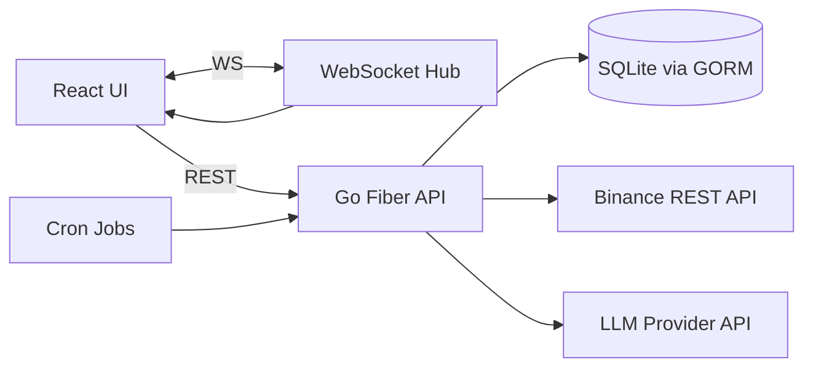
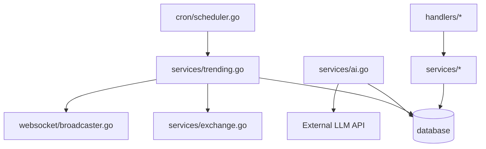

# AGENTS.md — Trading Bot Codebase Guide

## Core Functionality and Value Proposition
- End-to-end crypto trading platform that combines automated technical analysis, AI-generated trade proposals, and real-time portfolio monitoring.
- Provides a full-stack experience: Go backend for analysis/trading logic and a React frontend for live dashboards and controls.
- Supports both live exchange interaction (Binance API) and paper-trade style simulated trades for safe testing.

## Distinctive Features vs Typical LLM Agent Implementations
- AI proposals are first-class domain objects with approval/denial workflows and persistence in a trading DB, not just transient chat outputs.
- Hybrid automation: scheduled trending analysis can auto-open trades while AI proposals remain human-approval gates.
- Weighted technical indicator scoring that can be tuned dynamically via persisted indicator weights and settings.
- Real-time state synchronization (wallet, positions, orders, snapshots, logs) via a WebSocket hub with initial full-sync and incremental updates.
- Tight coupling between analysis history and AI prompts to ground LLM suggestions on recent market data.

## Technical Architecture Overview
- Backend: Go (Fiber HTTP server, GORM ORM, SQLite by default).
- Frontend: React (Vite), real-time updates via WebSocket manager singleton.
- Data layer: GORM models for wallet, positions, orders, settings, AI proposals, activity logs, analysis history, snapshots.
- Messaging: In-process WebSocket Hub + Broadcaster singleton for fan-out to all clients or rooms.
- Scheduling: Cron jobs for recurring price updates and trending analysis.

## High-Level Data Flow

## Key Algorithms and Design Patterns
- Indicator calculations: RSI, MACD, Bollinger Bands, Momentum, Volume MA.
  - [indicators.go](file:///f:/Sites/trading-bot/internal/services/indicators.go)
- Weighted scoring and signal determination (BUY/SELL/HOLD, STRONG_* signals).
  - [analyzer.go](file:///f:/Sites/trading-bot/internal/services/analyzer.go)
  - [trending.go](file:///f:/Sites/trading-bot/internal/services/trending.go)
- Trending analysis pipeline mirrors a prior Python design with rating conversion and normalized scoring.
  - [trending.go](file:///f:/Sites/trading-bot/internal/services/trending.go)
- AI proposal pipeline: build prompt from recent analyses + wallet + positions + settings, parse JSON response safely.
  - [ai.go](file:///f:/Sites/trading-bot/internal/services/ai.go)
- WebSocket Hub + Broadcaster singleton pattern for centralized fan-out.
  - [hub.go](file:///f:/Sites/trading-bot/internal/websocket/hub.go)
  - [broadcaster.go](file:///f:/Sites/trading-bot/internal/websocket/broadcaster.go)

## Critical Code Sections (Role and Location)
- Server entrypoint and route wiring: [main.go](file:///f:/Sites/trading-bot/cmd/server/main.go)
  - Initializes config, DB, cron, routes, websocket hub, and static frontend.
- Configuration loading and defaults: [config.go](file:///f:/Sites/trading-bot/internal/config/config.go)
- Database models and schema: [models.go](file:///f:/Sites/trading-bot/internal/database/models.go)
- Database init + seed data: [database.go](file:///f:/Sites/trading-bot/internal/database/database.go)
- Trading execution + auto-close logic: [trading.go](file:///f:/Sites/trading-bot/internal/services/trading.go)
- Analysis engine and scoring: [analyzer.go](file:///f:/Sites/trading-bot/internal/services/analyzer.go)
- Indicator math and helper funcs: [indicators.go](file:///f:/Sites/trading-bot/internal/services/indicators.go)
- Trending analysis pipeline + auto-trade: [trending.go](file:///f:/Sites/trading-bot/internal/services/trending.go)
- Exchange API wrapper (Binance REST): [exchange.go](file:///f:/Sites/trading-bot/internal/services/exchange.go)
- AI proposal generation/approval: [ai.go](file:///f:/Sites/trading-bot/internal/services/ai.go)
- WebSocket client lifecycle + protocol: [client.go](file:///f:/Sites/trading-bot/internal/websocket/client.go)
- WebSocket hub + broadcaster: [hub.go](file:///f:/Sites/trading-bot/internal/websocket/hub.go), [broadcaster.go](file:///f:/Sites/trading-bot/internal/websocket/broadcaster.go)
- API handlers by domain: [handlers](file:///f:/Sites/trading-bot/internal/handlers)
- Frontend dashboard + LLM config UI: [App.jsx](file:///f:/Sites/trading-bot/frontend/src/App.jsx), [LLMConfig.jsx](file:///f:/Sites/trading-bot/frontend/src/components/LLMConfig.jsx)
- WebSocket client manager (reconnect + heartbeat): [websocketManager.js](file:///f:/Sites/trading-bot/frontend/src/services/websocketManager.js)

## Configuration Requirements and Setup
- Environment variables (defaults in [.env.example](file:///f:/Sites/trading-bot/.env.example)):
  - PORT, DATABASE_PATH, DEFAULT_BALANCE, DEFAULT_CURRENCY
  - BINANCE_API_KEY, BINANCE_SECRET (required for live trading)
  - REDIS_ADDR/REDIS_PASSWORD/REDIS_DB (present but not currently used in services)
- Local dev (backend):
  - `go run cmd/server/main.go` or `make run`
- Local dev (frontend):
  - `cd frontend && npm install && npm run dev`
- Full build:
  - `make build-all` (build frontend + production backend)
- Docker build/run:
  - `make docker-build` and `make docker-run`
  - [Dockerfile](file:///f:/Sites/trading-bot/Dockerfile), [run.sh](file:///f:/Sites/trading-bot/run.sh)

## API Endpoints (Backend)
Base path: `/api`
- Health/config: `GET /health`, `GET /config`
- Wallet: `GET /wallet`, `PUT /wallet`, `GET /wallet/snapshots`
  - [wallet.go](file:///f:/Sites/trading-bot/internal/handlers/wallet.go)
- Positions: `GET /positions`, `POST /positions`, `POST /positions/:id/close`, `DELETE /positions/:symbol`
  - [positions.go](file:///f:/Sites/trading-bot/internal/handlers/positions.go)
- Orders: `GET /orders`, `POST /orders`
  - [orders.go](file:///f:/Sites/trading-bot/internal/handlers/orders.go)
- Settings: `GET /settings`, `PUT /settings`, `GET /settings/:key`
  - [settings.go](file:///f:/Sites/trading-bot/internal/handlers/settings.go)
- Indicator weights: `GET /indicator-weights`, `PUT /indicator-weights`
  - [settings.go](file:///f:/Sites/trading-bot/internal/handlers/settings.go)
- Trading: `POST /trading/buy`, `POST /trading/sell`, `POST /trading/update-prices`
  - [trading.go](file:///f:/Sites/trading-bot/internal/handlers/trading.go)
- Paper trades: `POST /positions-trade/open`, `POST /positions-trade/:id/close`
  - [positions.go](file:///f:/Sites/trading-bot/internal/handlers/positions.go)
- Analysis: `GET /analysis/:symbol`, `GET /analysis`, `POST /analysis/analyze`
  - [analyzer.go](file:///f:/Sites/trading-bot/internal/handlers/analyzer.go)
- Trending: `GET /trending`, `GET /trending/recent`, `POST /trending/analyze`
  - [analyzer.go](file:///f:/Sites/trading-bot/internal/handlers/analyzer.go)
- Activity logs: `GET /activity-logs`, `POST /activity-logs`
  - [activity.go](file:///f:/Sites/trading-bot/internal/handlers/activity.go)
- AI proposals: `GET /ai/proposals`, `POST /ai/generate-proposals`, `POST /ai/proposals/:id/approve`, `POST /ai/proposals/:id/deny`
  - [ai.go](file:///f:/Sites/trading-bot/internal/handlers/ai.go)
- WebSocket: `WS /ws` (real-time updates)
  - [websocket.go](file:///f:/Sites/trading-bot/internal/handlers/websocket.go)

## WebSocket Message Types (Selected)
- Wallet/positions/orders: `wallet_update`, `positions_update`, `orders_update`, `position_update`
- Analysis/trending: `trending_update`, `analysis_complete`, `snapshot_update`
- Activity: `activity_log_new`, `activity_log_bulk`
- Trade events: `trade_executed`
  - [broadcaster.go](file:///f:/Sites/trading-bot/internal/websocket/broadcaster.go)

## Performance Optimizations
- Batch price updates using `FetchMultipleTickerPrices` to avoid per-position requests.
  - [trading.go](file:///f:/Sites/trading-bot/internal/services/trading.go)
- Trending analysis limits and deduplication to reduce API calls and computation.
  - [trending.go](file:///f:/Sites/trading-bot/internal/services/trending.go)
- WebSocket backpressure handling with buffered channels and drop-on-failure.
  - [hub.go](file:///f:/Sites/trading-bot/internal/websocket/hub.go)
- Frontend reconnection with exponential backoff and heartbeat to reduce stale connections.
  - [websocketManager.js](file:///f:/Sites/trading-bot/frontend/src/services/websocketManager.js)

## Security Considerations
- Binance API requests are HMAC signed for private endpoints.
  - [exchange.go](file:///f:/Sites/trading-bot/internal/services/exchange.go)
- LLM API key is stored in DB and sent as bearer token to the configured provider.
  - [ai.go](file:///f:/Sites/trading-bot/internal/services/ai.go)
- Current CORS policy is permissive (`*`). Consider tightening for production.
  - [cors.go](file:///f:/Sites/trading-bot/internal/middleware/cors.go)
- API endpoints have no authentication/authorization layer; intended for trusted environments.

## Testing Strategy
- Unit tests cover indicators and exchange utility functions.
  - [indicators_test.go](file:///f:/Sites/trading-bot/internal/services/indicators_test.go)
  - [exchange_test.go](file:///f:/Sites/trading-bot/internal/services/exchange_test.go)
- Configuration defaults are verified in tests.
  - [config_test.go](file:///f:/Sites/trading-bot/internal/config/config_test.go)
- Integration tests exercise Fiber endpoints with in-memory SQLite.
  - [integration_test.go](file:///f:/Sites/trading-bot/internal/testing/integration_test.go)
- Run tests with `go test -v ./...` (see [Makefile](file:///f:/Sites/trading-bot/Makefile)).

## Deployment Instructions
- Container build/run:
  - `make docker-build` and `make docker-run`
  - [Dockerfile](file:///f:/Sites/trading-bot/Dockerfile), [docker-compose.yml](file:///f:/Sites/trading-bot/docker-compose.yml)
- Prod build (binary + frontend):
  - `make build-all`
- Direct server run:
  - `make run` or `go run cmd/server/main.go`

## Notable Implementation Details and Extension Points
- Indicator weighting and settings are stored in DB and can be updated live via API.
- AI proposals are persisted with status transitions and can mutate settings on approval.
- WebSocket uses an initial full-sync on connect for robust UI hydration.
- Frontend’s LLM config UI exists even if LLM calls are disabled or unconfigured; backend uses DB config when available.

## Suggested Modification Hotspots
- Trading strategy/thresholds: [trending.go](file:///f:/Sites/trading-bot/internal/services/trending.go), [trading.go](file:///f:/Sites/trading-bot/internal/services/trading.go)
- Indicator logic and scoring: [indicators.go](file:///f:/Sites/trading-bot/internal/services/indicators.go), [analyzer.go](file:///f:/Sites/trading-bot/internal/services/analyzer.go)
- AI prompt format and response parsing: [ai.go](file:///f:/Sites/trading-bot/internal/services/ai.go)
- Real-time UX: [websocketManager.js](file:///f:/Sites/trading-bot/frontend/src/services/websocketManager.js), [useWebSocket.js](file:///f:/Sites/trading-bot/frontend/src/hooks/useWebSocket.js)
