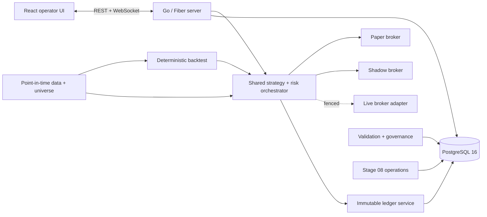

# Trading Platform

A deterministic cryptocurrency research and paper-trading platform built with Go, PostgreSQL 16, and React. The system shares strategy and risk logic across backtest, paper, and future live adapters, records economic activity in an immutable ledger, requires point-in-time historical inputs, and gates promotion on auditable out-of-sample evidence.

The implementation follows [`roadmap.md`](roadmap.md). Stages 00–08 are implemented; legacy code remains only for controlled rollback/cutover compatibility. Direct live exchange submission is intentionally fenced.

## What the rewrite provides

- One strategy decision and portfolio risk path for backtest, paper, and live adapters.
- Immutable cash/fill/fee/capital-adjustment ledger with transaction-coupled projections.
- Exact reconciliation for wallet, position quantity, cost basis, fees, and realized P&L.
- Deterministic backtests with next-executable-bar fills, explicit costs, partial-fill policy, and final-position policy.
- Point-in-time bars, listings, delistings, tradability intervals, symbol constraints, and universe membership.
- Cash, buy-and-hold, BTC trend, equal-weight, and cross-sectional momentum baselines at comparable exposure/costs.
- A documented trend/momentum candidate kept behind research/shadow fences until validation passes.
- Purged multi-window walk-forward validation, bootstrap statistics, immutable experiment manifests, promotion gates, and rollback criteria.
- Stage 08 feature flags, parity evidence, persistent cutover authority, backup/restore fingerprints, and operational status.
- PostgreSQL least-privilege separation between migration, runtime, ledger, and parity principals.
- Authenticated React operator interface, REST API, and WebSocket updates.

## Safety boundaries

This repository does **not** claim that a strategy is profitable or ready for live capital merely because tests pass.

- Live exchange order submission is fenced.
- Model/test/bootstrap artifacts cannot control paper or live entries.
- Strategy/model promotion requires authenticated human approval and valid immutable evidence.
- Missing coverage, zero-trade evidence, unreconciled accounting, stale cutover authority, or malformed backup evidence fails closed.
- A fresh install can be healthy at the process level while operational status remains `degraded` until real data, validation, parity, backup, and elapsed shadow evidence exists.
- External market-history quality, sufficient sample sizes, exchange behavior, and elapsed shadow operation cannot be created by unit tests.

## Architecture



### Main packages

| Path | Responsibility |
|---|---|
| `internal/tradingcore` | exact values, decisions, strategy, risk, brokers, exits, orchestration, determinism |
| `internal/ledger` | immutable economic events, fills, corrections, backfill, reconciliation |
| `internal/backtest` | replay, costs, manifests, baselines, candidate strategy, validation inputs |
| `internal/pointintime` | historical bars/metadata, coverage, manifests, universe snapshots |
| `internal/validation` | walk-forward evaluation, bootstrap statistics, diagnostics, evidence |
| `internal/governance` | experiments, policies, deployments, approvals, rollback state |
| `internal/cutover` | Stage 08 flags, authority, parity, transition contracts |
| `internal/operations` | status, fingerprint, backup evidence, restore and migration controls |
| `internal/database` | PostgreSQL models, migrations, roles, pools, principal validation |
| `internal/services` | application adapters for exchange data, analysis, execution, models, monitoring |
| `internal/handlers` | authenticated HTTP boundaries |
| `frontend` | React/Vite operator interface |

## Requirements

- PostgreSQL 16
- Docker + Docker Compose (recommended runtime)
- Go 1.26.1 for repository verification
- Bun or Node.js 18+ for frontend development/build

## Database roles

The platform intentionally uses separate connections:

| Variable | Principal | Purpose |
|---|---|---|
| `MIGRATION_DATABASE_URL_FILE` | administrative | one-shot bootstrap/migrations only |
| `RUNTIME_DATABASE_URL_FILE` / `DATABASE_URL_FILE` | `trading_bot_app_runtime` | long-lived runtime reads and operational state |
| `LEDGER_DATABASE_URL_FILE` | `trading_bot_app_ledger` | immutable ledger/economic transactions |
| `PARITY_DATABASE_URL_FILE` | `trading_bot_app_parity` | parity evidence only |

The server does not receive the migration DSN. Ledger/parity connections do not fall back to runtime. See [`docs/database-roles.md`](docs/database-roles.md).

## Quick start with Compose

### 1. Prepare configuration

```bash
cp .env.example .env
chmod 600 .env
```

Set at least:

- `AUTH_USERNAME`
- `AUTH_PASSWORD`
- `GOVERNANCE_ADMIN_USERS`
- paths for all required `*_FILE` variables
- safe Stage 08 flags (the defaults in `.env.example` are legacy-authoritative/off)

Store secrets outside the repository, mode `0600`. Compose requires files for:

```text
postgres_password
migration_database_url
runtime_database_password
ledger_database_password
parity_database_password
runtime_database_url
ledger_database_url
parity_database_url
```

The migration URL points to PostgreSQL as the administrative login. Runtime DSNs target the Compose host `postgres`, database `trading_bot`, and their dedicated application logins. The bootstrap job creates/rotates those login passwords from the three password files.

Never commit `.env`, secret files, DSNs, pgpass/service files, dumps, or API keys.

### 2. Validate and start

```bash
docker compose config --quiet
docker compose up -d --build
```

Expected state:

- `postgres`: running and healthy
- `bootstrap`: exited with code `0` (one-shot job)
- `app`: running on `http://localhost:5001`

```bash
docker compose ps -a
curl -I http://127.0.0.1:5001/login
```

The fresh database receives migrations, restricted application logins, Stage 08 bootstrap authority, and one opening-capital ledger event (default `400 USDT`).

### Reset the entire database

This destroys all PostgreSQL data:

```bash
docker compose down --volumes --remove-orphans
docker compose up -d --build
```

## Authentication

The UI, API, and WebSocket use the configured operator session. Governance transitions additionally require the authenticated username in `GOVERNANCE_ADMIN_USERS`.

```text
UI:  http://localhost:5001/login
API: http://localhost:5001/api
WS:  ws://localhost:5001/ws
```

## Auto Trade setting

`auto_trade_enabled` is an authenticated operational enable/kill switch for automated **paper-entry evaluation**.

- `true`: analysis may produce paper order intents through the shared strategy/risk engine.
- `false`: entry evaluation returns `auto_trade_disabled`.
- Accepted persisted values are exactly `true` or `false`.
- Changing it does not authorize live exchange submission, promote a strategy/model, bypass risk, or alter Stage 08 authority.

Other strategy, risk, model, universe, rollout, fee/slippage, and backtest settings are authority-affecting. They must move through research/governance workflows rather than silent generic settings mutation.

## Command-line tools

All commands require the DSNs appropriate to their action. Prefer `*_FILE` variables.

### Server

```bash
go run ./cmd/server
```

The long-lived server requires runtime, ledger, and parity connections, but never migration/admin.

### Bootstrap

```bash
go run ./cmd/bootstrap
```

One-shot migrations, grants, login provisioning, seed boundary, and Stage 08 initialization. Requires migration plus runtime/ledger/parity DSNs and bootstrap password files.

### Ledger

```bash
go run ./cmd/ledger -action reconcile -json
```

Actions:

- `reconcile`
- `backfill` (dry-run by default; application requires explicit approval)
- `asset-correction`
- `reverse`

An unbalanced reconciliation exits with code `2`.

### Backtest

```bash
go run ./cmd/backtest \
  -symbols BTCUSDT,ETHUSDT \
  -start 2024-01-01 \
  -end 2024-06-30 \
  -fee-bps 8 \
  -slippage-bps 3
```

Stage 05/06 registered-strategy comparison additionally accepts `-strategy`, `-strategy-version`, `-strategy-params`, `-target-gross`, `-max-net`, and `-final-policy`; it requires `STAGE08_NEW_BACKTEST=research`.

### Point-in-time market data

```bash
go run ./cmd/marketdata -action coverage -manifest-id <id> ...
```

Actions:

- `ingest`
- `import-metadata`
- `build-manifest`
- `coverage`
- `build-universe`
- `build-universe-range`

Mutating/build actions require Stage 04 authority (`STAGE08_POINT_IN_TIME_UNIVERSE=research` or `authoritative`).

### Operations

```bash
go run ./cmd/operations -action status
go run ./cmd/operations -action verify
go run ./cmd/operations -action fingerprint
```

Additional isolated workflows:

- `restore-verify`
- `record-backup -manifest <path> -principal <operator>`

Canonical fingerprints include schema, data, owners/ACLs, constraints, indexes, triggers, functions, sequences, views, RLS, default privileges, and protected-role membership. Backup evidence is created through a server-enforced PostgreSQL function; runtime cannot insert directly into the evidence table.

## Feature flags and cutover

Safe defaults:

```dotenv
STAGE08_FLAG_SCHEMA_VERSION=stage08-flags-v1
STAGE08_LEDGER_AUTHORITY=legacy
STAGE08_SHARED_ENGINE=off
STAGE08_NEW_BACKTEST=off
STAGE08_POINT_IN_TIME_UNIVERSE=off
STAGE08_CANDIDATE_STRATEGY=off
STAGE08_DUAL_RUN=off
STAGE08_STAGE07_CONTEXT=
```

Local flags must match persisted authority during normal startup. Restore verification and backup evidence bind to authority persisted in the restored database, not to local defaults. Follow [`docs/operations/feature-flags-and-cutover.md`](docs/operations/feature-flags-and-cutover.md); do not improvise a live transition.

## Development and verification

```bash
# Test PostgreSQL
make test-db-up

# Full backend suite against real PostgreSQL
TEST_DATABASE_URL='postgres://postgres:<test-password>@127.0.0.1:5433/trading_bot_test?sslmode=disable' \
  go test -p 1 -count=1 ./...

# Static/backend checks
go vet ./...
git diff --check

# Frontend
cd frontend
npm install
npm run build
cd ..

# Compose
docker compose config --quiet
```

PostgreSQL integration tests must use real PostgreSQL for roles, grants, `SET ROLE`, transactions, deferred triggers, RLS, security-definer functions, migrations, fingerprints, and restore semantics.

## API overview

All `/api` endpoints are authenticated except the login/session flow.

- `GET /api/health` — process and operational health; can return `503` when evidence is degraded.
- `GET /api/operations/status` — Stage 08/reconciliation/parity/coverage status.
- `GET|PUT /api/settings` — read settings and mutate permitted operational controls.
- `GET /api/settings/governance` — active governance context/policies.
- `GET /api/positions`, `GET /api/orders`, `GET /api/wallet` — economic projections.
- `POST /api/analysis/analyze`, `POST /api/trending/analyze` — analysis pipelines.
- `POST /api/backtest/start`, `GET /api/backtest/jobs` — persisted backtest jobs.
- `GET /api/ai/proposals`, proposal approval/denial, and backtest optimization endpoints — advisory/governed AI workflows.
- `/api/marketdata/*`, `/api/universe/*`, `/api/validation/*`, `/api/governance/*` — data, evidence, and controlled rollout surfaces.

Direct position/order creation and live buy/sell submission are fenced where they would bypass the shared engine or immutable accounting.

## Operations and runbooks

Start with [`docs/operations/README.md`](docs/operations/README.md):

- fresh install and upgrades
- feature flags, rollout, and rollback
- ledger reconciliation
- point-in-time dataset coverage
- backtest reproduction
- strategy/model promotion
- broker/idempotency recovery
- backup, isolated restore, and disaster recovery

Detailed rewrite contracts live in [`docs/reimplementation/`](docs/reimplementation/).

## License

MIT
